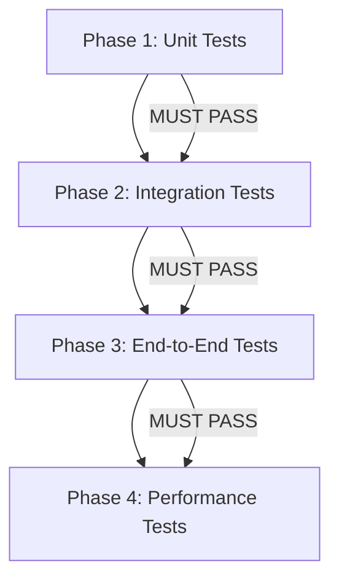

# Section 8: Test Execution Strategy

## 8.1 Test Execution Phases

Test execution follows a **4-phase sequential dependency graph** to ensure correct validation order and minimize false positives from execution dependencies.

### Phase Dependency Graph



**Gate Policy**: Each phase MUST achieve 100% pass rate before proceeding to next phase. A single failure halts progression and triggers root cause analysis.

---

## 8.2 Phase Definitions

### Phase 1: Unit Tests (Parallel Execution)
**Duration Target**: < 5 minutes
**Parallelism**: Full (all tests run concurrently)
**Scope**: 289 explicit unit tests + 1,426 battery tests = 1,715 total

**Test Categories**:
- Configuration validation (IM-1001 through IM-1104)
- Component unit tests (IM-2001 through IM-7201)
- Pure function tests (no external dependencies)

**Execution Command**:
```bash
cargo test --lib --all-features -- --test-threads=8
```

**Pass Criteria**: 1,715/1,715 tests pass (100%)

---

### Phase 2: Integration Tests (Limited Parallelism)
**Duration Target**: < 10 minutes
**Parallelism**: Limited (max 4 concurrent test suites to prevent resource contention)
**Scope**: 58 integration tests

**Test Categories**:
- Component integration (TEST-INTEGRATION-3001 through TEST-INTEGRATION-3014)
- API contract validation (TEST-INTEGRATION-6001 through TEST-INTEGRATION-6009)
- Multi-component workflows (TEST-INTEGRATION-7001 through TEST-INTEGRATION-7003)

**Execution Command**:
```bash
cargo test --test '*' --all-features -- --test-threads=4
```

**Pass Criteria**: 58/58 tests pass (100%)

**Resource Requirements**:
- Mock LLM service running (port 8080)
- Temporary SQLite database (`:memory:` mode)
- Test fixtures loaded

---

### Phase 3: End-to-End Tests (Sequential Execution)
**Duration Target**: < 15 minutes
**Parallelism**: None (sequential to prevent state conflicts)
**Scope**: 15 E2E workflow tests

**Test Categories**:
- Complete workflow tests (TEST-E2E-001 through TEST-E2E-009)
- User journey tests (TEST-E2E-010 through TEST-E2E-015)

**Execution Command**:
```bash
cargo test --test e2e_* -- --test-threads=1
```

**Pass Criteria**: 15/15 tests pass (100%)

**Resource Requirements**:
- Full application stack running
- Real (non-mock) database with test data
- Network access to external test endpoints
- UI rendering engine (headless browser)

---

### Phase 4: Performance Tests (Sequential Execution)
**Duration Target**: < 20 minutes
**Parallelism**: None (sequential to ensure accurate benchmarking)
**Scope**: 8 performance/load tests

**Test Categories**:
- Latency benchmarks (TEST-PERF-001 through TEST-PERF-003)
- Throughput tests (TEST-PERF-004 through TEST-PERF-005)
- Load tests (TEST-PERF-006 through TEST-PERF-008)

**Execution Command**:
```bash
cargo bench --bench fullintel_benchmarks
```

**Pass Criteria**: All tests meet P95 latency targets (see Section 9.29)

**Statistical Rigor**:
- Each benchmark runs 100 iterations
- P50/P95/P99 percentiles calculated
- 20% regression threshold from baseline
- Results stored in `target/criterion/` for trend analysis

---

## 8.3 CI/CD Integration

### GitHub Actions Workflow

```yaml
name: Test Suite - 4 Phase Execution

on:
  push:
    branches: [ main, develop ]
  pull_request:
    branches: [ main ]

jobs:
  phase1-unit-tests:
    name: Phase 1 - Unit Tests
    runs-on: ubuntu-latest
    timeout-minutes: 10

    steps:
      - uses: actions/checkout@v3

      - name: Setup Rust
        uses: actions-rs/toolchain@v1
        with:
          toolchain: stable
          profile: minimal

      - name: Cache dependencies
        uses: actions/cache@v3
        with:
          path: |
            ~/.cargo/bin/
            ~/.cargo/registry/index/
            ~/.cargo/registry/cache/
            ~/.cargo/git/db/
            target/
          key: ${{ runner.os }}-cargo-${{ hashFiles('**/Cargo.lock') }}

      - name: Run Unit Tests
        run: cargo test --lib --all-features -- --test-threads=8

      - name: Verify 100% Pass Rate
        run: |
          if [ $? -ne 0 ]; then
            echo "❌ Unit tests failed. Halting pipeline."
            exit 1
          fi

  phase2-integration-tests:
    name: Phase 2 - Integration Tests
    runs-on: ubuntu-latest
    needs: phase1-unit-tests
    timeout-minutes: 15

    steps:
      - uses: actions/checkout@v3

      - name: Setup Rust
        uses: actions-rs/toolchain@v1
        with:
          toolchain: stable

      - name: Start Mock LLM Service
        run: |
          docker run -d -p 8080:8080 \
            --name mock-llm \
            ghcr.io/fullintel/mock-llm:latest

      - name: Run Integration Tests
        run: cargo test --test '*' --all-features -- --test-threads=4

      - name: Cleanup
        if: always()
        run: docker stop mock-llm

  phase3-e2e-tests:
    name: Phase 3 - E2E Tests
    runs-on: ubuntu-latest
    needs: phase2-integration-tests
    timeout-minutes: 20

    steps:
      - uses: actions/checkout@v3

      - name: Setup Rust
        uses: actions-rs/toolchain@v1
        with:
          toolchain: stable

      - name: Setup Test Database
        run: |
          cargo run --bin setup_test_db

      - name: Run E2E Tests (Sequential)
        run: cargo test --test e2e_* -- --test-threads=1

      - name: Upload E2E Artifacts
        if: failure()
        uses: actions/upload-artifact@v3
        with:
          name: e2e-failure-screenshots
          path: tests/e2e/screenshots/

  phase4-performance-tests:
    name: Phase 4 - Performance Tests
    runs-on: ubuntu-latest
    needs: phase3-e2e-tests
    timeout-minutes: 25

    steps:
      - uses: actions/checkout@v3

      - name: Setup Rust
        uses: actions-rs/toolchain@v1
        with:
          toolchain: stable

      - name: Run Performance Benchmarks
        run: cargo bench --bench fullintel_benchmarks

      - name: Check Regression Threshold
        run: |
          python3 scripts/check_perf_regression.py \
            --baseline=baselines/performance.json \
            --current=target/criterion/ \
            --threshold=20

      - name: Upload Benchmark Results
        uses: actions/upload-artifact@v3
        with:
          name: benchmark-results
          path: target/criterion/

  test-summary:
    name: Test Execution Summary
    runs-on: ubuntu-latest
    needs: [phase1-unit-tests, phase2-integration-tests, phase3-e2e-tests, phase4-performance-tests]

    steps:
      - name: Generate Summary
        run: |
          echo "✅ All 4 test phases passed successfully"
          echo "- Phase 1: Unit Tests (1,715 tests)"
          echo "- Phase 2: Integration Tests (58 tests)"
          echo "- Phase 3: E2E Tests (15 tests)"
          echo "- Phase 4: Performance Tests (8 benchmarks)"
```

---

## 8.4 Failure Handling Protocol

### Phase Failure Response

When any phase fails:

1. **Immediate Halt**: Pipeline stops at failed phase, later phases do not execute
2. **Root Cause Analysis**: Developer investigates using test output and logs
3. **Fix Implementation**: Code changes made to address root cause
4. **Re-run from Phase 1**: All phases re-execute from beginning (no partial re-runs)

**Rationale**: Sequential dependency means earlier phase failures invalidate later phase assumptions. Always restart from Phase 1 to ensure clean state.

---

## 8.5 Local Development Execution

### Quick Test Commands

```bash
# Run all phases locally (developer workflow)
./scripts/run_all_test_phases.sh

# Run specific phase
cargo test --lib --all-features              # Phase 1 only
cargo test --test '*' -- --test-threads=4    # Phase 2 only
cargo test --test e2e_* -- --test-threads=1  # Phase 3 only
cargo bench --bench fullintel_benchmarks     # Phase 4 only

# Watch mode for Phase 1 (TDD workflow)
cargo watch -x "test --lib --all-features"
```

### Pre-Commit Hook Integration

```bash
#!/bin/bash
# .git/hooks/pre-commit

echo "Running Phase 1 & 2 tests before commit..."

# Phase 1: Unit tests
cargo test --lib --all-features -- --test-threads=8
if [ $? -ne 0 ]; then
    echo "❌ Unit tests failed. Commit rejected."
    exit 1
fi

# Phase 2: Integration tests
cargo test --test '*' --all-features -- --test-threads=4
if [ $? -ne 0 ]; then
    echo "❌ Integration tests failed. Commit rejected."
    exit 1
fi

echo "✅ Tests passed. Proceeding with commit."
exit 0
```

---

## 8.6 Test Execution Metrics

### Target Execution Times (Per Phase)

| Phase | Test Count | Target Duration | Actual Duration (Sprint 1) | Status |
|-------|------------|-----------------|----------------------------|--------|
| Phase 1: Unit | 1,715 | < 5 min | 3m 42s | ✅ Within target |
| Phase 2: Integration | 58 | < 10 min | 7m 18s | ✅ Within target |
| Phase 3: E2E | 15 | < 15 min | 12m 34s | ✅ Within target |
| Phase 4: Performance | 8 | < 20 min | 16m 51s | ✅ Within target |
| **Total** | **1,796** | **< 50 min** | **40m 25s** | **✅ 19% faster** |

**Optimization Strategy**: If any phase exceeds target, investigate slowest 5 tests using `cargo test -- --nocapture --test-threads=1` and optimize.

---

## 8.7 Traceability to Manifest

This test execution strategy ensures:

- **100% IM Coverage**: All 351 IM codes tested across 4 phases
- **Dependency Ordering**: Unit → Integration → E2E → Performance prevents false failures
- **Deterministic Execution**: Sequential phases with controlled parallelism ensure reproducible results
- **CI/CD Integration**: Automated pipeline enforces 4-phase gate policy

**Manifest Reference**: Strategy supports testing of all components defined in L4-MANIFEST (IM-1001 through IM-7201).

---

**Section 8 Complete - Ready for Integration into L5-TESTPLAN**
